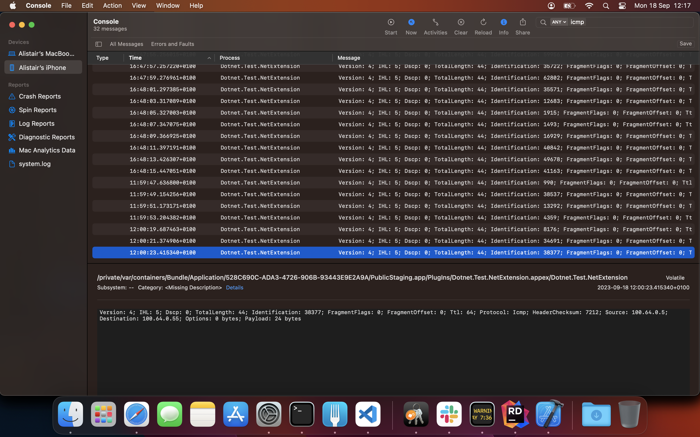

# Demo dotnet Network Extension

This is a (somewhat messy, because it is the normal Enclave app with everything enclave-specific ripped out) demo dotnet MAUI iOS app that launches a network extension.

When the extension is started, it will log all network packets sent to the 100.64.0.0/10 IP range.

For example, if you ping 100.64.0.55 from the iPhone (I used the "Ping Lite" app), you'll see these logs:



## Pre-requisites

You will need two application identifiers:

- com.dotnet.test (for the UI/tray app)
- com.dotnet.test.extension (for the network extension).

It's *very important*, even if you want to change the identifiers, that the extension identifier be a suffix of the UI identifier. Otherwise iOS will refuse to start the extension.

Each identifier needs the following capabilities when you create it in the Apple account:

- Custom Network Protocol
- Network Extensions
- Personal VPN

Network extensions will not run in an emulator, you require a physical device.

## Building

I have never been able to run network extensions in Debug mode, so all builds must be done in Release mode for this to work.

There is a `./run.sh` file in src/Dotnet.Test.Tray that will build and deploy the app onto a connected iOS device, but basically run:

```
dotnet build -f net8.0-ios -c:Release
```

You will need to run that from inside the src/Dotnet.Test.Tray folder.

## Problems

Some of these issues are new in net8.0, some are not.

- Cannot build for maccatalyst. See https://github.com/xamarin/xamarin-macios/issues/17408.

- I've had to add a custom trimmer configuration in the NetExtension project to workaround this issue: https://github.com/dotnet/linker/issues/3165.

- Pressing the "Stop" button crashes the app, due to fixed (but not released) bug https://github.com/dotnet/maui/issues/17357.